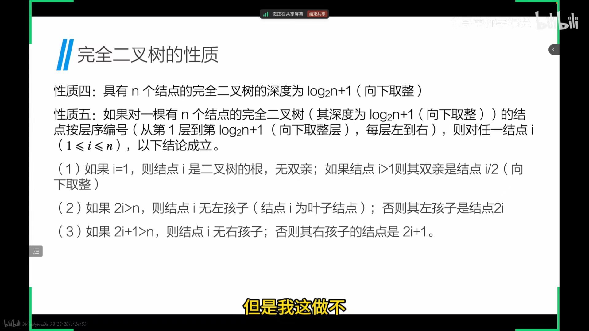

# 一、数据结构(二叉树)//b站的逊老师
## 1)树的定义
一个或多个结点的有限集合  
存在一个根，特定结点  
每个结点互不相交
### 1.结点：
树中的一个独立单元
### 2.结点的度：
结点拥有的子树数称为结点的度
### 3.树的度：
树内各结点度的最大值
### 4.叶子：
度为0的结点或者终端结点
### 5.非终端结点：
度不为0的结点
### 双亲和孩子：
结点的子树的根称为该结点的孩子，相应的该结点称为孩子的双亲
### 层次：
结点的层次从根开始定义，数层数
## 2)树的性质
1.树中的所有结点数等于所有结点的度数之和加1  
2.对于度为m的树，第i层上最多有m^(i-1)个结点
3.对于高度为h，度为m的树，最多有(m^h-1)/(m-1)个结点
## 3)二叉树：
n个结点所构成的集合，它或为空树，或为非空树T  
①有且仅有一个称为根的结点  
②除根结点以外的其余结点分为两个互不相交的子集T1和T2，分别称为T的左子树和右子树，且都为二叉树  
③每个结点之多只有两棵子树  
④有左右之分，且次序不能颠倒
### 1.性质
①二叉树的第i层最多有2^(i-1)个结点  
②深度为k的二叉树做多有2^k-1个人结点  
③对于任何非空的二叉树，若叶子结点的个数为n0，而度为2的结点为n2，则n0=n2+1
## 4)特殊的二叉树
### 1.满二叉树
深度为k且含有2^k-1个结点的二叉树  
①所有叶子结点只能出现在最后一层  
②对于同样深度的二叉树，满二叉树结点个数最多  
③对满二叉树编号，根结点从1开始，从上到下从左到右，对于编号为i的结点，若存在左孩子，则做孩子的编号为2i，又孩子为2i+1  
④必为奇数节点总数，偶数个必有一个n1  
PS:nX，度为x的结点数
### 2.完全的二叉树
深度为k的有n个结点的二叉树，当且仅当每个结点都与深度为k的满二叉树中编号从1至n的结点
①叶子结点只可能在层次最大的两层上出现
②若其右分支下的子孙的最大层次为i，则其左分支的子孙的最大层次必为i或i+1

## 5)二叉树存储
### 顺序结构
除了满二叉树和完全二叉树占用率较高
### 链式结构
